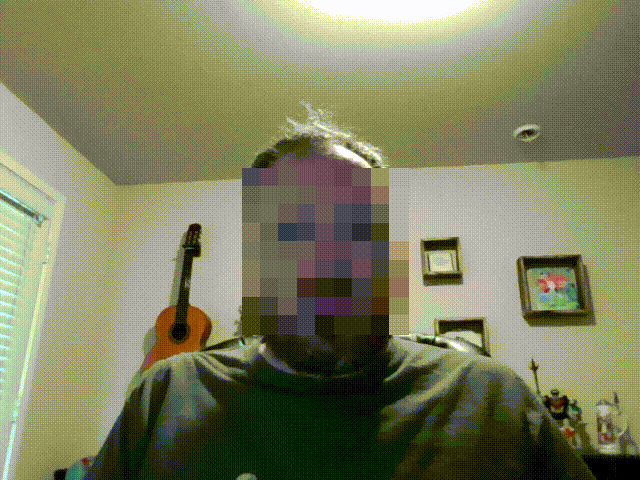
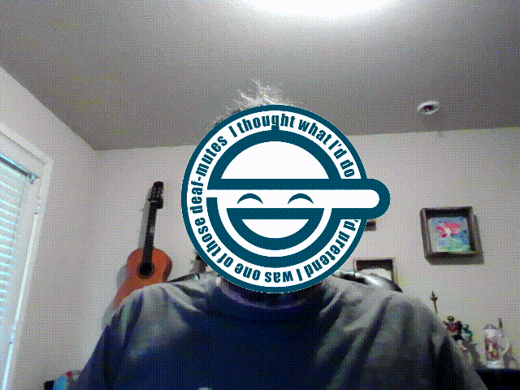

# Virtual Foregrounds in Zoom
This is a quick thing I threw together to have some fun in Zoom meetings. It uses the v4l2loopback kernel module and the pyfakewebcam python library (sorry, both Linux only) to create and interact with a fake capture device and two python scripts that take frames from the real capture device, find faces in the frames with opencv, do stuff to the faces, and then write the modified frames out to the fake capture device.

## Prerequisites
```
sudo apt install v4l2loopback-utils
sudo apt install python3-opencv
pip3 install pyfakewebcam
```
## Running
The two python files are `deface.py` for pixelating faces and `reface.py` for doing the laughing man thing from Ghost in the Shell. The usage is the same for both scripts -- just start up the v4l2loopback module in exclusive_caps mode and feed the path to the newly created video device to the script as an argument.
```
sudo modprobe v4l2loopback exclusive_caps=1
python3 deface.py `ls /dev/video* | tail -1`
```
Then start up Zoom or whatever conference software you use, go to video settings, and select `Dummy video device` as your camera. And that's it.

## What you end up with
### deface.py

### reface.py


NOTE: I would not trust this to do any kind of anonymization/censoring that you actually care about. I did this pretty quickly, and the face detection is not even close to perfect, so even though I did go to some lengths to try and prevent it your ugly mug might still end up on camera.
